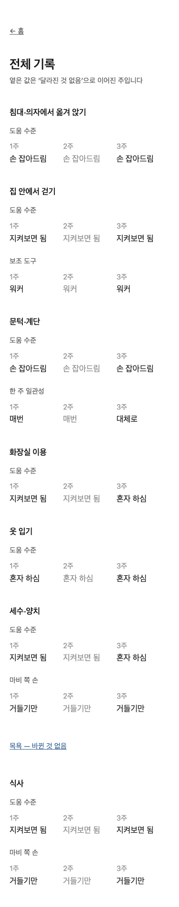
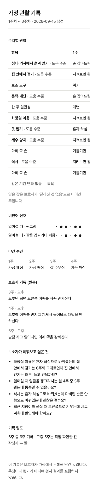
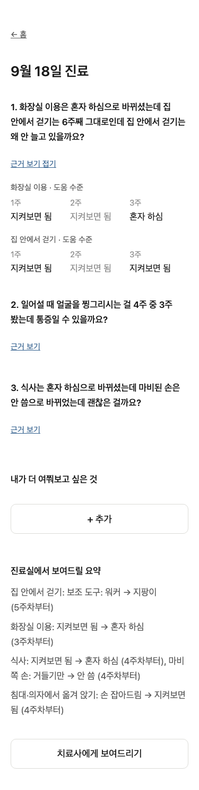
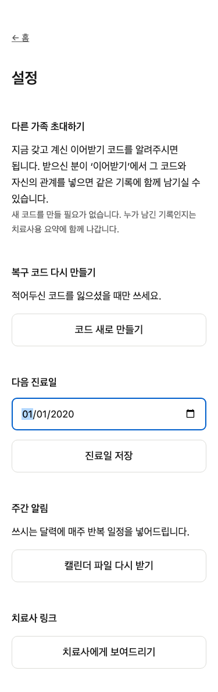
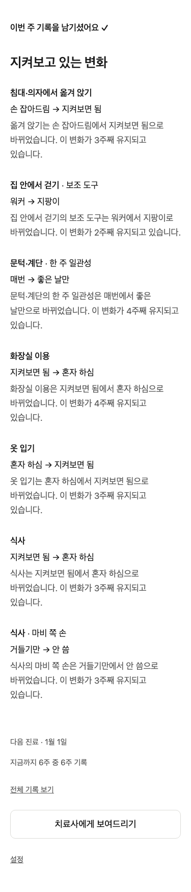
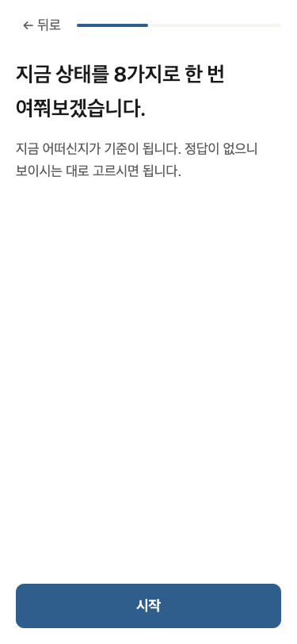
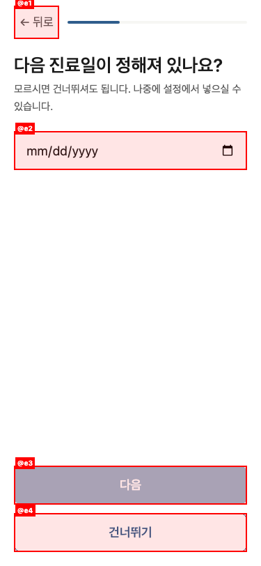
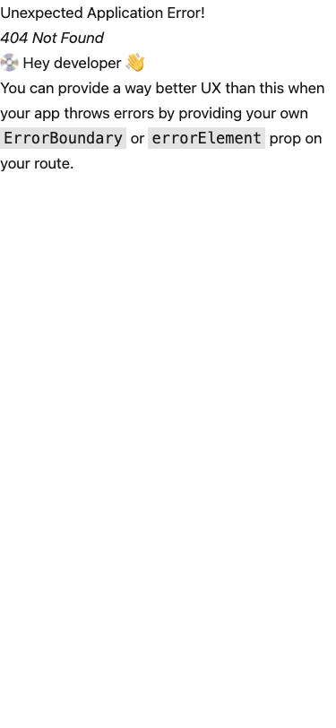
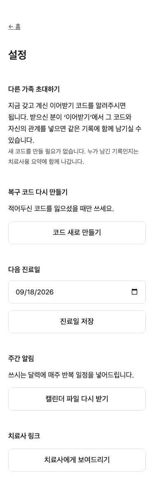
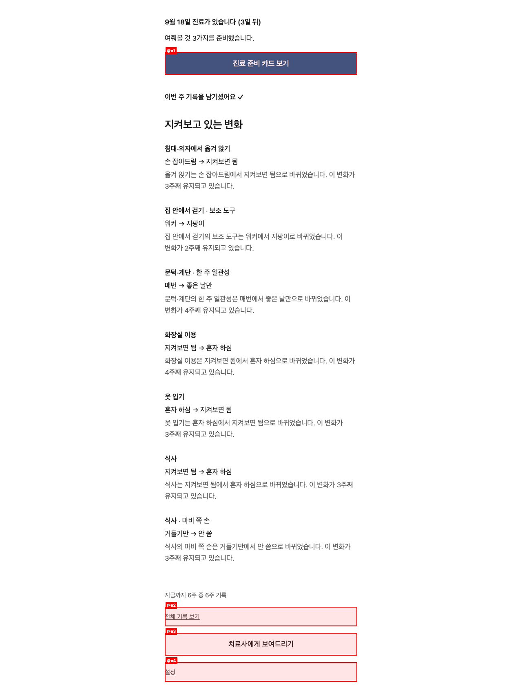

# QA Report: 집에서 본 것 (ByGuardian)

| Field | Value |
|-------|-------|
| **Date** | 2026-09-15 |
| **URL** | https://byguardian.pages.dev |
| **Branch** | main |
| **Commit** | 5c38aef (2026-09-15) |
| **Tier** | Full |
| **Scope** | Public landing, onboarding, recovery, guardian home, demo, prep card, trajectory, settings, therapist share view, error states |
| **Duration** | 22m 23s |
| **Pages / states visited** | 11 routes, 30+ interaction states |
| **Screenshots** | 65 |
| **Framework** | React SPA / React Router |
| **Viewport coverage** | 375x812, 768x1024, 1280x720 |

## Health Score: 89/100

| Category | Score |
|----------|-------|
| Console | 100 |
| Links | 100 |
| Visual | 85 |
| Functional | 85 |
| UX | 76 |
| Performance | 92 |
| Content | 100 |
| Accessibility | 84 |

## Top 3 Things to Fix

1. **ISSUE-001: 모바일에서 4~6주차 기록이 화면 밖으로 잘립니다.** 핵심 경과 데이터가 보호자·치료사 화면 모두에서 보이지 않습니다.
2. **ISSUE-002: 과거 날짜를 다음 진료일로 저장할 수 있습니다.** 홈이 지난 날짜를 다음 진료로 표시하고 진료 준비 동선도 사라집니다.
3. **ISSUE-003: 온보딩 질문 수 안내가 실제 흐름과 다릅니다.** 8가지를 묻는다고 안내하지만 기본 질문 4개 뒤에 다시 8개와 조건부 하위 질문이 이어집니다.

## Console Health

- 정상 흐름에서는 JavaScript 오류가 없었습니다.
- 잘못된 이어받기 코드 제출 시 API 404가 콘솔에 남지만, 화면에는 “코드를 다시 확인해 주세요.”라는 적절한 오류가 표시됩니다. 의도한 오류 입력 테스트 결과로 점수에서 제외했습니다.
- 존재하지 않는 앱 경로에서는 React Router 기본 오류가 콘솔에 기록됩니다. ISSUE-005로 별도 기록했습니다.

## Summary

| Severity | Count |
|----------|-------|
| Critical | 0 |
| High | 2 |
| Medium | 6 |
| Low | 0 |
| **Total** | **8** |

## Issues

### ISSUE-001: 모바일에서 6주 기록 표의 뒤쪽 주차가 잘림

| Field | Value |
|-------|-------|
| **Severity** | high |
| **Category** | visual |
| **URLs** | `/trajectory`, `/prep-card`, `/t#<share-token>` |

**Description:** 375px 모바일 화면에서 6주 기록이 한 줄로만 배치되고 페이지의 가로 스크롤도 막혀 있습니다. 4~6주차 열은 viewport 밖(x=356~823)에 있으나 문서 너비는 375px로 고정되어 사용자가 접근할 수 없습니다. 치료사 공유 화면에서는 주차별 핵심 표가 사실상 1주차만 보입니다.

**Repro Steps:**

1. 모바일 너비 375px에서 데모 기록을 만듭니다.
2. “전체 기록 보기” 또는 치료사 공유 주소를 엽니다.
3. 6주 기록 표를 확인합니다.
4. **Observe:** 4~6주차 또는 2~6주차 데이터가 오른쪽으로 잘리고 가로 스크롤로도 볼 수 없습니다.

---

### ISSUE-002: 과거 날짜가 “다음 진료일”로 저장됨

| Field | Value |
|-------|-------|
| **Severity** | high |
| **Category** | functional |
| **URL** | `/settings` → `/` |

**Description:** 진료일 입력에 최소 날짜 제한이 없고 2020-01-01 같은 과거 날짜가 서버에 정상 저장됩니다. 새로고침 후에도 유지되며 홈에서는 “다음 진료 · 1월 1일”로 표시됩니다. 이 상태에서는 진료 준비 카드 CTA도 사라집니다.

**Repro Steps:**

1. 설정에서 “다음 진료일”에 `2020-01-01`을 입력합니다.
2. “진료일 저장”을 누릅니다.
3. 설정을 새로고침해 과거 날짜가 유지되는지 확인합니다.
4. 홈으로 이동합니다.
5. **Observe:** 지난 날짜가 “다음 진료”로 표시되고 진료 준비 카드 링크가 보이지 않습니다.

---

### ISSUE-003: 온보딩이 “8가지” 안내보다 훨씬 김

| Field | Value |
|-------|-------|
| **Severity** | medium |
| **Category** | ux |
| **URL** | `/onboarding` |

**Description:** 시작 화면은 “8가지를 여쭤봅니다”라고 안내합니다. 실제로는 관계, 진단, 마비 방향, 의사소통, 진료일 등 기본 질문이 먼저 이어진 뒤 다시 “지금 상태를 8가지로” 묻고, 각 항목에서 보조 도구·일관성·마비 쪽 손 같은 하위 질문도 추가됩니다. 사용자가 예상한 노력과 실제 완료 시간이 다릅니다.

**Repro Steps:**

1. 로그아웃 상태에서 “시작하기”를 엽니다.
2. “5분 정도, 8가지” 안내를 확인합니다.
3. 기본 질문을 모두 완료합니다.
4. **Observe:** 다시 8가지 상태 질문이 시작되고 다수의 조건부 하위 질문이 추가됩니다.

---

### ISSUE-004: 온보딩의 진료일 입력에 접근성 이름이 없음

| Field | Value |
|-------|-------|
| **Severity** | medium |
| **Category** | accessibility |
| **URL** | `/onboarding` |

**Description:** “다음 진료일이 정해져 있나요?” 화면의 날짜 입력은 접근성 트리에서 이름 없는 `textbox`로 노출됩니다. 화면 읽기 도구 사용자는 이 입력이 무엇인지 컨트롤 자체만으로 식별하기 어렵습니다.

**Repro Steps:**

1. 온보딩에서 진료일 질문까지 이동합니다.
2. 접근성 트리를 확인합니다.
3. **Observe:** 날짜 필드가 `textbox`로만 나오고 “다음 진료일” 같은 이름이 없습니다.

---

### ISSUE-005: 존재하지 않는 경로가 개발자용 오류 화면을 노출함

| Field | Value |
|-------|-------|
| **Severity** | medium |
| **Category** | ux |
| **URL** | `/not-a-real-page` |

**Description:** 잘못된 북마크나 오래된 링크로 존재하지 않는 경로를 열면 영어로 된 React Router 기본 개발자 오류 화면이 나옵니다. 홈으로 돌아가는 링크도 없습니다.

**Repro Steps:**

1. `https://byguardian.pages.dev/not-a-real-page`를 엽니다.
2. 새로고침하여 재현을 확인합니다.
3. **Observe:** “Unexpected Application Error! 404 Not Found”와 개발자 안내 문구가 표시되고 복구 동선이 없습니다.

---

### ISSUE-006: 인증 후 주요 화면이 약 3초 동안 단순 로딩 문구만 표시함

| Field | Value |
|-------|-------|
| **Severity** | medium |
| **Category** | performance |
| **URLs** | `/`, `/settings`, `/prep-card` |

**Description:** 설정 직접 진입을 반복 측정했을 때 상호작용 가능한 화면까지 약 3초가 걸렸습니다. 이 동안 좌측 상단에 “불러오는 중입니다...”만 표시됩니다. 같은 실행에서 `/catalog` 약 1.26초와 `/me` 약 1.02초가 이어졌습니다.

**Repro Steps:**

1. 인증된 상태에서 `/settings`를 직접 엽니다.
2. 즉시 화면을 확인하고 2초 뒤 다시 확인합니다.
3. **Observe:** 두 시점 모두 내용 대신 “불러오는 중입니다...”만 보이고, 약 3초 후 컨트롤이 나타납니다.

---

### ISSUE-007: 가족 초대 안내가 현재 이어받기 코드를 보여주지 않음

| Field | Value |
|-------|-------|
| **Severity** | medium |
| **Category** | ux |
| **URL** | `/settings` |

**Description:** “다른 가족 초대하기”는 “지금 갖고 계신 이어받기 코드를 알려주시면 됩니다”와 “새 코드를 만들 필요가 없습니다”라고 안내하지만 현재 코드를 화면에서 확인하거나 복사할 방법이 없습니다. 아래에는 “코드 새로 만들기”만 있어 사용자가 안내와 행동 사이에서 막힙니다.

**Repro Steps:**

1. 온보딩을 완료한 뒤 설정을 엽니다.
2. “다른 가족 초대하기” 섹션을 확인합니다.
3. **Observe:** 현재 코드는 표시되지 않고 새 코드 생성 동작만 있습니다.

---

### ISSUE-008: 보호자 홈에 문서 제목·섹션 제목 구조가 없음

| Field | Value |
|-------|-------|
| **Severity** | medium |
| **Category** | accessibility |
| **URL** | `/` (인증 후) |

**Description:** 보호자 홈은 시각적으로 진료일과 “지켜보고 있는 변화”를 강조하지만 접근성 트리에서는 모두 paragraph로만 노출되고 heading이 하나도 없습니다. 긴 변화 목록에서 화면 읽기 도구의 제목 단위 탐색을 사용할 수 없습니다.

**Repro Steps:**

1. 데모 기록 또는 실제 기록의 보호자 홈을 엽니다.
2. 접근성 트리를 확인합니다.
3. **Observe:** `main` 아래에 paragraph, link, button만 있고 heading 역할이 없습니다.

## What Worked

- 랜딩의 세 가지 진입 동선과 데스크톱·태블릿·모바일 레이아웃이 정상입니다.
- 데모 생성, 보호자 화면 진입, 진료 준비 카드, 근거 펼치기, 전체 기록, 치료사 공유 주소 생성과 공개 보기까지 동작합니다.
- 사용자 질문 추가와 저장이 새로고침 후에도 유지됩니다.
- 잘못된 이어받기 코드는 사용자 친화적인 오류 문구로 처리됩니다.
- 유효한 데모 이어받기 코드는 다른 관계로 기록을 되찾는 데 성공했습니다.
- 만료되었거나 잘못된 치료사 주소는 한국어 오류 문구를 표시합니다.
- 정상 흐름에서 콘솔 오류나 실패한 네트워크 요청은 없었습니다.
- Playwright 테스트 설정이 프로젝트에 존재합니다.

## Test Limits

- 새 복구 코드를 만드는 동작은 기존 코드 효력에 영향을 줄 수 있어 실행하지 않았습니다.
- 새 주소 생성은 기존 치료사 주소를 무효화하므로 실행하지 않았습니다.
- 온보딩 완료 시 첫 주 기록이 함께 생성되어 같은 날의 주간 재기록 흐름은 노출되지 않았습니다.
- 브라우저의 실제 캘린더 앱 연결까지는 확인하지 않았습니다.

## Ship Readiness

| Metric | Value |
|--------|-------|
| Health score | 89/100 |
| Issues found | 8 |
| High-severity issues | 2 |
| Fixes applied | 0 (report-only) |

**Assessment:** 데스크톱 기준 주요 흐름은 안정적입니다. 다만 모바일이 주 사용 환경이라면 ISSUE-001은 출시 품질을 막는 문제입니다. 과거 진료일 저장 문제도 실제 사용자의 준비 흐름을 깨뜨립니다.
