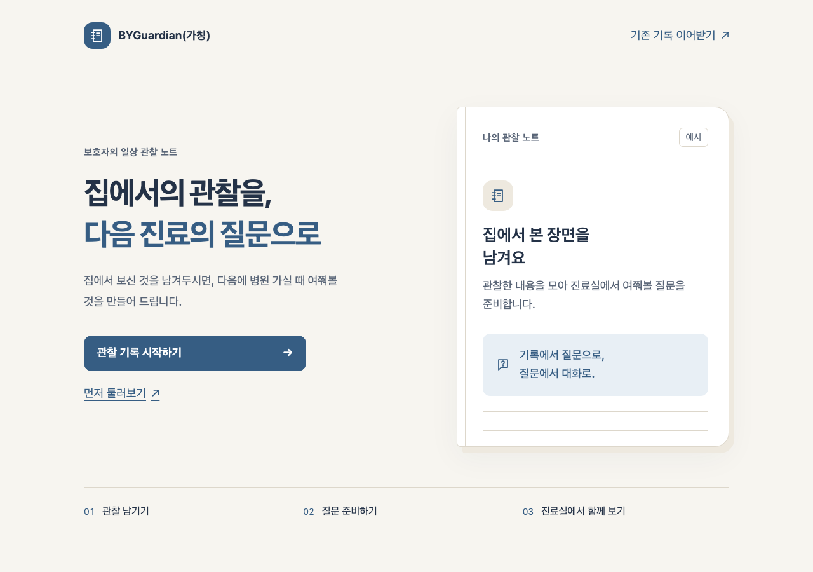

# 따뜻한 관찰 노트 — UI 개선 및 QA 보고서

검증일: 2026-09-16 · 승인 계획: 2026-09-15 · 브랜치: `codex/warm-observation-ui`

## 결과 요약

랜딩부터 기록·진료 준비·공유까지 승인된 **따뜻한 관찰 노트** 디자인을 적용했다. 종이색 배경, 흰 노트 면, 읽기 쉬운 글자와 버튼으로 정보의 우선순위를 만들었다. 파란색은 브랜드·조작·선택에만 사용하며, 환자의 호전·악화·위험도를 색으로 표현하지 않는다.

프런트엔드 단위 테스트 **275개**, 브라우저 테스트 **13개**, 타입 검사와 배포용 빌드가 통과했다. 브라우저 테스트 중 **1개는 실제 로컬 API·PostgreSQL을 연결한 통합 흐름**, 나머지 **12개는 합성 응답 기반 UI 검증**이다. 운영 사이트 재배포·운영 데이터 수정·실제 사용자 연구는 수행하지 않았다.

## 화면과 사용성 변경

| 영역 | 개선 내용 |
| --- | --- |
| 첫 방문 | 서비스 설명, 하나의 주 행동, 예시 노트, 이용 순서를 구분했다. 넓은 화면에서는 두 열, 모바일에서는 한 열이다. |
| 보호자 홈 | 미기록·기록 완료·가까운 진료에 따라 핵심 행동을 우선 배치했다. 조회 실패를 ‘변화 없음’으로 안내하지 않는다. |
| 온보딩·주간 기록 | 현재 구간과 진행 수를 표시한다. 선택은 체크 표식과 접근성 상태로 알리고, 질문 이동 때만 제목에 초점을 옮긴다. |
| 진료 준비 | 각 질문과 관찰 근거를 하나의 노트로 묶었다. 추가 질문은 여러 줄 입력칸이며, 저장 실패나 저장 중 추가 편집에서도 내용을 보존한다. |
| 전체 기록·치료사 보기 | ‘직접 확인’, ‘지난 값 유지’, ‘미기록’을 글자로 구분한다. 표는 이름 있는 영역 안에서 좌우 이동하며 인쇄에서는 전체 폭을 보여준다. |
| 설정·이어받기·공유 | 진료일·가족 이어받기·알림·공유를 나눴다. 저장·복사 성공과 실패, 재시도를 명확히 표시한다. |
| 공통 | 일반 본문 18px, 보조 글자 16px, 주요 버튼 최소 높이 56px. 포커스 테두리와 움직임 감소 설정을 지원한다. |

서버의 질문·관찰 문장, API 계약, 기존 저장 단계와 초안, 비공개 공유의 fragment 토큰 및 비캐시 경계는 유지했다. 건강 점수나 진단·운동 추천 기능을 추가하지 않았다.

## 변경 전후 비교

변경 전 기준은 `eab5977`, 변경 후는 `4116f52`의 제품 코드다. 같은 합성 데이터와 같은 화면 너비로 비교했다. 화면 속 날짜와 관찰 내용은 테스트 예시이며 실제 사용자 데이터가 아니다.

| 화면 | 변경 전 | 변경 후 |
| --- | --- | --- |
| 랜딩 · 1280px | [이전 화면](screenshots/warm-observation-ui/before/landing-1280.png) | [개선 화면](screenshots/warm-observation-ui/after/landing-1280.png) |
| 가까운 진료 홈 · 375px | [이전 화면](screenshots/warm-observation-ui/before/home-375.png) | [개선 화면](screenshots/warm-observation-ui/after/home-375.png) |
| 주간 기록 · 375px | [이전 화면](screenshots/warm-observation-ui/before/record-375.png) | [개선 화면](screenshots/warm-observation-ui/after/record-375.png) |
| 진료 준비 · 375px | [이전 화면](screenshots/warm-observation-ui/before/prep-375.png) | [개선 화면](screenshots/warm-observation-ui/after/prep-375.png) |

### 개선된 랜딩



추가 검토 화면: [미기록 홈](screenshots/warm-observation-ui/after/unrecorded-375.png), [온보딩](screenshots/warm-observation-ui/after/onboarding-375.png), [설정](screenshots/warm-observation-ui/after/settings-375.png), [치료사 보기](screenshots/warm-observation-ui/after/therapist-375.png), [긴 질문과 추가 질문 5개](screenshots/warm-observation-ui/after/prep-stress-375.png).

## 실행한 검증과 결과

환경: macOS, Node 22.22.2, Java 21, Docker 28.3.2, Playwright Chromium. 화면 점검에는 로컬 Chromium 렌더링과 headless browse를 사용했다. 새 외부 서비스나 실제 보호자 계정을 검증용으로 사용하지 않았다.

| 검증 | 결과 | 범위 |
| --- | --- | --- |
| `npm --prefix frontend test` | 통과: 33파일, 275테스트 | 화면·상태·원문·저장·공유 회귀 검사. 기준선은 22파일, 248테스트였다. |
| `npm --prefix frontend run typecheck` | 통과 | TypeScript 전체 검사 |
| `npm --prefix frontend run build` | 통과 | 타입 검사, Vite 빌드 및 PWA 산출물 생성. 통합 스크립트에서도 실행한다. |
| `bash scripts/ci/integration-e2e.sh` | 통과: 13테스트 | 실제 통합 1개와 합성 UI 12개. 별도 테스트 DB·API·프런트엔드를 사용하고 종료 후 해당 자원만 정리했다. |
| 합성 UI 스펙 단독 재실행 | 통과: 12테스트 | 로컬 개발 화면에서 키보드 뒤로 이동·근거 펼치기 검사 보강 후 재실행 |
| `git diff --check` | 통과 | 최종 문서·테스트 변경의 공백 오류 검사 |

재실행 시 Node 22와 Java 21을 PATH/JAVA_HOME으로 선택하고 Docker를 켠다. 통합 스크립트는 기존 프로젝트 설정대로 LLM을 끄고 로컬 포트 55432·18080·14173을 사용한다. 로컬 개발 화면에서 합성 테스트만 실행하려면 아래와 같이 지정할 수 있다.

```bash
UI_TEST_BASE_URL=http://127.0.0.1:14174 npm --prefix frontend run test:e2e -- e2e/warm-observation.spec.ts
```

### 실제 연결한 사용자 흐름

기존 `critical-flow.spec.ts`의 6주 기록, 진료 준비 카드, 비공개 치료사 공유 흐름을 실제 API·DB로 실행했다. 승인된 화면 문구 두 곳의 탐색 이름만 갱신했으며, 기존 데이터·토큰·캐시 검사를 삭제하거나 완화하지 않았다. 이는 로컬 통합 검증이지 운영 배포 점검은 아니다.

### 반응형·키보드·확대

- 320·375·768·1280px에서 랜딩, 진료가 가까운 홈, 미기록 홈, 변화 없음 홈, 기록, 온보딩, 준비 카드, 전체 기록, 설정, 치료사 보기를 캡처했다. 긴 질문과 인쇄 스타일을 포함한 총 42개 캡처 상태에서 **페이지 전체 가로 넘침이 없었다**. 넓은 주차별 기록은 의도된 영역 내 스크롤이다.
- 자동 브라우저 검사는 네 너비의 랜딩·치료사 레이아웃, 모바일 표의 마지막 6주 값까지 방향키 이동, 선택→다음→뒤로 이동과 선택값 보존, 질문 근거 펼치기·접기, 조회 오류 재시도를 확인한다.
- 온보딩의 375×400px 환경에서 하단 버튼이 고정 해제되어 접근 가능한지 확인했다. 실제 휴대폰 가상 키보드를 켠 시험을 대신하지는 않는다.
- 200% 검증은 실제 요소의 글자 크기를 두 배로 설정한 사용자 스타일 방식이다. 단순히 viewport를 줄이지 않았다. 375px 랜딩·온보딩·설정·진료 준비·치료사 보기에서 페이지 가로 넘침이 없었고, 랜딩 제목의 실제 계산 크기가 두 배임을 검사했다. 브라우저 메뉴의 페이지 확대나 모바일 pinch 확대 시험과는 구분한다.
- 5개의 긴 추가 질문이 textarea에서 여러 줄로 보이고, 해당 합성 문장이 내부 세로 잘림 없이 표시되는지 검사했다.
- 잘못된 치료사 링크와 없는 경로에서는 오류 안내 및 키보드 복귀 링크를 별도로 확인했다.

### 색상·대비·흑백

선택은 체크 표식·테두리·`aria-pressed`를 함께 사용한다. 관찰 출처는 별도 텍스트로 표시하므로 색상만으로 읽지 않아도 된다. [흑백 선택 화면](screenshots/warm-observation-ui/after/onboarding-selected-grayscale-375.png)에서도 선택 표식이 남는다.

WCAG 상대 휘도 공식으로 토큰의 대비를 계산하고, 실제 본문·버튼의 계산된 색상과 배경을 교차 확인했다. 아래는 대표 조합이며 모든 픽셀에 대한 접근성 인증을 뜻하지 않는다.

| 조합 | 대비 | 기준 |
| --- | --- | --- |
| 본문 `#243247` / 흰 면 | 12.95:1 | 일반 글자 4.5:1 |
| 보조 글자 `#586476` / 흰 면 | 6.00:1 | 일반 글자 4.5:1 |
| 보조 글자 / 종이 보조 면 `#EEE9DF` | 4.96:1 | 일반 글자 4.5:1 |
| 흰 버튼 글자 / 파랑 `#365D83` | 6.88:1 | 일반 글자 4.5:1 |
| 입력 경계 `#7C8794` / 흰 면 | 3.65:1 | 조작 경계 3:1 |
| 입력 경계 / 배경 `#F7F5F0` | 3.35:1 | 조작 경계 3:1 |
| 포커스 파랑 / 선택 면 `#E8EFF5` | 5.93:1 | 포커스 경계 3:1 |

비조작 노트 구분선과 비활성 버튼은 위의 활성 컨트롤 경계 검사에 포함하지 않았다. 관찰값별로 서로 다른 건강 의미 색을 부여하지 않았다.

### A4 인쇄

치료사 화면에 6주 기록과 45줄의 합성 원문 메모를 넣어 Chromium에서 A4 PDF로 출력하고, 생성된 **2페이지 전부를 이미지로 렌더링해 확인**했다. 첫 주·마지막 주, 표 제목과 다음 페이지로 이어지는 메모가 잘리지 않았다. 인쇄에서는 배경·그림자·고정 열·스크롤 제약을 제거한다.

[A4 1페이지](screenshots/warm-observation-ui/after/final-print-page-1.png) · [A4 2페이지](screenshots/warm-observation-ui/after/final-print-page-2.png)

이 결과는 해당 데이터와 Chromium 출력에 대한 확인이며, 임의 길이·다른 프린터 드라이버의 모든 분할을 보증하지 않는다.

## 리뷰와 화면 점검에서 찾아 수정한 문제

| 발견 사항 | 반영한 수정 | 검증 |
| --- | --- | --- |
| 추가 질문 저장 요청 중 새로 편집한 내용이 이전 응답에 덮일 수 있음 | 제출 시점의 편집 버전을 비교하고 저장 응답으로 캐시를 갱신 | 지연 저장·추가 입력 및 조회 실패 회귀 테스트 |
| 진료일 저장 중 수정하면 요청 상태가 초기화되어 겹치는 저장을 허용할 수 있음 | 요청 중 날짜 입력을 비활성화하고 요청 상태를 유지 | 지연 저장 테스트, 저장 후 새로고침·날짜 제거 E2E |
| 치료사 연결 실패 상태의 공통 안내·재시도 표현 누락 | 별도 치료사 경계를 유지하면서 공통 제목·오류·재시도 UI 적용 | 연결 실패와 재시도 테스트 |
| 긴 추가 질문이 한 줄 입력칸 안에서 잘림 | 여러 줄 textarea 및 내용 기반 높이 적용 | 브라우저에서 실패 재현 후 수정, 긴 질문 5개 검사 통과 |
| 긴 원문 메모 인쇄가 섹션 전체를 다음 장으로 밀어 첫 장에 큰 공백 생성 | 긴 메모 구역은 페이지 간 분할 허용, 제목·문단 분할 규칙 조정 | 인쇄 CSS 회귀 검사와 실제 2페이지 A4 확인 |

앞의 세 항목은 별도 코드 리뷰에서 찾아 반영했고, 뒤의 두 항목은 이후 직접 화면·인쇄 검증에서 발견해 수정했다. 수정 후 관련 테스트와 전체 검증을 다시 실행했다.

## 변경 이력과 주요 파일

| 커밋 | 내용 |
| --- | --- |
| `4aa9495` | 공통 디자인 토큰·상태·선택·헤더 |
| `8e58dd5` | 랜딩·상태별 홈 |
| `d51d507` | 기록 진행·포커스 |
| `995d9f8` | 질문·근거 그룹과 저장 안내 |
| `99c1e9d` | 기록 출처·모바일·인쇄 읽기 |
| `bd923aa` | 설정·복구·공유 피드백 |
| `3330589` | 저장 중 편집·날짜 요청·치료사 연결 오류 수정 |
| `4116f52` | 긴 질문과 인쇄 페이지 흐름 수정 |

이후 별도 QA 커밋에 브라우저 테스트·본 보고서·대표 이미지·계획 완료 표시를 묶는다.

주요 구현 파일은 `frontend/src/styles.css`, `frontend/src/screens/`의 Landing·Home·Onboarding·Record·PrepCard·Trajectory·Therapist·Settings·Recover·Demo·NotFound, `frontend/src/ui/`의 PageHeader·AsyncState·Choice·Screen·Collapse·ScrollRegion·ObservationValue·CopyButton·TherapistLinkPanel이다. `frontend/src/lib/catalog.tsx`, `queries.ts`, `flowProgress.ts` 및 관련 단위 테스트를 함께 수정했다. 브라우저 회귀 검사는 `frontend/e2e/warm-observation.spec.ts`에 추가했다.

## 남은 확인과 배포 범위

- 실제 40~70대 보호자 인터뷰·사용성 연구는 하지 않았다. 화면 개선과 자동 동작 검증을 사용자 연구 결과로 해석하면 안 된다.
- 실기기 iOS·Android, Safari·Firefox, 네이티브 가상 키보드, 스크린 리더 음성 사용 시험은 하지 않았다. 특히 textarea 자동 높이는 지원 브라우저마다 다를 수 있으며 기본 여러 줄·크기 조절 기능을 유지한다.
- 200% 글자 검사는 명시한 화면과 데이터만 대상으로 했다. 접근성 전체 준수 인증이나 모든 콘텐츠 조합의 보장은 아니다.
- 백엔드 코드를 바꾸지 않았으며 이번 단계에서 백엔드 전체 단위 테스트를 별도로 실행하지 않았다. 실제 API·DB 통합 시나리오는 위 범위로 통과했다.
- 운영 부하·네트워크 품질·배포 후 캐시 갱신은 이번 로컬 QA의 검증 대상이 아니다.
- 변경 사항은 작업 브랜치에 커밋하며 **main 병합·원격 푸시·PR 생성·운영 배포는 아직 하지 않았다.**

승인 명세: [따뜻한 관찰 노트 디자인](../superpowers/specs/2026-09-15-warm-observation-ui-design.md) · 실행 계획: [구현 계획](../superpowers/plans/2026-09-15-warm-observation-ui.md)
